# Reckoning v0.3.9 teacher pilot learning-history pack（draft）

> 狀態：`DRAFT / EXTERNAL EVIDENCE PENDING`
>
> 這份文件是學習歷程與正式實測的可回填底稿，不是已完成的老師成果報告。它只記錄目前已能由 GitHub、CI、公開 Release 與本機測試證明的內容；老師姓名、簽名、外部 rubric、第二台電腦、臨時 API key 與真人教學回饋全部留白，不能用自動測試或 fixture 數值代填。

## 1. 題目與學習目標

Reckoning 的目標不是只顯示「AI 認為哪一步比較好」，而是把一個中國象棋局面轉成學生可以複盤、核對與反思的學習材料。一次完整的老師 pilot 要回答三個問題：

1. 引擎是否真的留下足夠的局面、著法與主線證據，讓解說不必靠抽象術語或分數猜測？
2. AI 是否能把實戰步、候選最佳步、對手的具體利用方式與後續後果連成五段可教學的因果解釋？
3. 老師是否能把解說轉成學生下一次可以實際練習或反思的行動？

預計受測者包含兩種外部角色：

- 專業象棋老師：判斷棋理、走子合法性、主線忠實度與解說是否可以帶學生複盤。
- 學習歷程／教學老師：判斷回答是否讓學生看懂「為什麼」、是否能形成反思問題、練習方法或下一步行動。

目前尚未取得兩位老師的實際評分或同意使用的質性回饋，因此本文件不把任何教學價值寫成已驗證。

## 2. 版本歷史與問題修正

| 版本／階段 | 已完成的工程工作 | 尚未能由此推出的結論 |
| --- | --- | --- |
| v0.3.7 | 保留歷史 unsigned prerelease，建立 GitHub Release 來源與更新門檻的歷史證據。 | 不能推出 Win10/Win11 clean-client gate 已完成；舊 client evidence run 已取消。 |
| v0.3.8 | 建立 teacher-test run manifest、保守 case ID、匿名 review link、非同步 installer SHA-256、正向 allowlist export 與六題 fixture baseline。 | 不能推出有老師、第二台機器、真人 rubric 或正式簽章。 |
| v0.3.9 | 修正 teacher-test export 的 run isolation：有 `runManifest` 時，trace 與 regression case 只保留同一個 `testRunId`；新增回歸測試並以新 tag／新 installer 發布。 | 仍不能推出老師雙機驗收、模型內容正確率、教學價值或 formal Release 已完成。 |

本次工程問題的因果鏈如下：

1. 原本的 Harness export 會列出本機保存期限內的所有 trace。
2. 如果測試機先前有其他 run，export 可能把舊 run 或另一台測試留下的資料混入目前 evidence pack。
3. 這會破壞「每台機器六題、每個 run 獨立、兩台 artifact 相同但 run ID 不同」的驗收條件。
4. v0.3.9 以目前 `runManifest.testRunId` 同時篩選 trace 與 regression case，並用單元測試固定這個邊界。

## 3. 系統架構與證據鏈

```mermaid
flowchart LR
  A["Frozen case / teacher-confirmed case"] --> B["FEN + side-to-move + attached move + question"]
  B --> C["Pikafish engine evidence"]
  C --> D["HarnessOrchestrator"]
  D --> E["Five-section AI explanation"]
  E --> F["Trace + evaluation link"]
  F --> G["Run-scoped teacher-test export"]
  G --> H["External teacher rubric"]
  H --> I["Issue -> fix -> regression case"]
```



核心邊界如下：

- `TeacherTestRunService` 在 main process 暫存 run context，保存 release tag、product source commit、installer filename／SHA-256 與 Windows runtime；不把完整 installer path、hostname、姓名或 API key 放進 manifest。
- `canonicalizeTeacherTestCase` 只對 case identity 做 NFC 與 CRLF→LF 正規化，不折疊空白、不改標點、不做語義改寫。
- `HarnessOrchestrator` 使用引擎留下的局面與主線證據；AI 的回答若證據不足，應明確區分已證明、推論與未知。
- `HarnessTraceStore` 用正向 allowlist 保存與 export trace；v0.3.9 另以 `evaluation.testRunId` 做 run isolation。
- 老師姓名、簽名與質性理由留在外部 rubric，以 `testRunId`、`testCaseId`、`externalReviewId` 對接，不進 App export。

## 4. 目前案例集狀態

目前 `docs/operations/teacher-test-cases-v1.json` 的 machine-readable 狀態是：

```json
{
  "caseSetStatus": "fixture-only; teacher-confirmation-pending",
  "teacherConfirmedCaseCount": 0,
  "teacherConfirmedCaseSlotsRequired": 3
}
```

六題目前全部來自既有 PlayOK acceptance fixture。它們可以驗證 case canonicalization、引擎 fixture、trace schema 與 export allowlist，但不是老師已確認的正式 pilot 題目。正式 pilot 尚需三個外部提供或明確確認的題目：

| 待補槽位 | 計畫要求 | 教師提供／確認資料 | 狀態 |
| --- | --- | --- | --- |
| Teacher case A | 防守資源／對手如何利用 | 待填 FEN 或 WXF、side-to-move、實戰步、問題與確認日期 | `pending` |
| Teacher case B | PlayOK WXF 中局 | 待填 WXF 來源、題目局面、實戰步與確認日期 | `pending` |
| Teacher case C | 需要回答「為什麼／如何反思」 | 待填學生背景、問題、預期反思行動與確認日期 | `pending` |

老師確認後，應重新凍結六題文件、更新 metadata、重新執行 frozen-case test，並讓兩台電腦使用完全相同的 case 文件。不可只在聊天或 rubric 口頭替換題目而不留下可重播的 identity。

## 5. 目前已取得的工程與 Release 證據

| 證據 | 結果 | 可支持的說法 |
| --- | --- | --- |
| v0.3.9 merged source | `5514b3ecfc63481a3942a277605d9114f1b54308` | teacher-test export 修正已合併，且 Release workflow 以此 commit 執行。 |
| v0.3.9 annotated tag | object `6172332bd8433aedc6f5ce59223a07271fb35dae`；peeled commit `5514b3ecfc63481a3942a277605d9114f1b54308` | tag、product source 與 workflow run 可互相核對。 |
| v0.3.9 Release workflow | run `31105552449`；build／publish／Server 2022／Server 2025 全成功 | 公開 unsigned teacher candidate 可重現；Server proxy 不是 Win10/Win11 clean-client evidence。 |
| v0.3.9 installer | `xiangqi-analyzer-0.3.9-setup.exe`；`164630467` bytes；SHA-256 `f29e5687437a54ea43a7f7fa75503e85a752aa64ae37ec6e0b9c9fb8c69df8b8` | 公開 artifact identity 可由 REST、`SHA256SUMS.txt` 與獨立串流 hash 交叉核對。 |
| v0.3.9 Release state | public、non-draft、prerelease、非 Latest；Latest 仍 v0.3.6 | unsigned candidate 沒有被誤升為正式 Latest。 |
| Windows CI | typecheck、full test、audit、production build 全綠 | 工程回歸與建置門檻通過，不等於真人教學驗收。 |
| run-isolation regression | previous run trace 不會進入 current run export | v0.3.9 修正了 evidence pack 的資料邊界。 |

詳細可核對文件：

- [`docs/operations/release-v0.3.9-evidence.md`](../operations/release-v0.3.9-evidence.md)
- [`docs/operations/teacher-test-cases-v1.json`](../operations/teacher-test-cases-v1.json)
- [`docs/operations/teacher-test-protocol-v1.md`](../operations/teacher-test-protocol-v1.md)
- [`PROJECT_STATUS.md`](../../PROJECT_STATUS.md)

## 6. 正式雙機實測方法

### 6.1 開始前

每台機器都必須從同一個 v0.3.9 GitHub Release 下載相同 installer，先讀取公開 `SHA256SUMS.txt`，核對檔名、大小與 SHA-256，並記錄未簽章 SmartScreen／Mark-of-the-Web 行為。兩台都要保存獨立的 run manifest；不能把開發端或 CI 的 runtime 當成老師電腦證據。

暫時 API key 只能在受測電腦的 SecretStore／本次流程使用：

- 不貼到聊天、issue、PR、screenshot、trace、export 或學習歷程文件。
- 測試完成後刪除，重開 App，確認 provider 未配置。
- 需要另外驗證 logs、工作目錄、export、trace 與提交內容沒有 key、Authorization、hostname、account 或完整 installer path。

### 6.2 每題操作

兩台都依同一份 frozen case 文件與同一順序操作：

1. 老師先不看 AI，獨立寫下對實戰步的判斷。
2. 匯入或載入局面，選取實戰步，確認 side-to-move。
3. 等待 Pikafish 證據與進度訊息；若等待超過門檻，保留明確結果，不把 timeout 改寫成「引擎證據不足」。
4. 產生五段 AI 解說：直接結論、實戰步問題、最佳步計畫、對手利用、練習／追問。
5. 可做一次 follow-up，但要保留同一 evidence chain。
6. 填四類產品回饋與外部 rubric；external rubric 只用匿名 evaluation link 對接。

每題都要留下 `testRunId`、`testCaseId`、`externalReviewId`、trace status、engine evidence、model-call／duration metadata 與必要的短評。若 FEN/WXF 無效、provider timeout、使用者取消、或 key 刪除後仍試圖呼叫，都要把結果記為 failure／pending，不以空白回答補過。

### 6.3 Rubric

每題由外部老師以 1–5 分評分；2 與 4 是相鄰描述之間的中間值：

| 維度 | 1 分 | 3 分 | 5 分 |
| --- | --- | --- | --- |
| 最佳著／實戰步判斷正確性 | 核心判斷錯誤或無法判斷 | 大致正確，但有重要遺漏 | 判斷正確，且指出實戰步與候選最佳步的關鍵差異 |
| 變化是否合法且連貫 | 有非法、跳步或矛盾變化 | 主線大致可走，但部分連接不完整 | 變化合法、連貫，且能回到引擎主線核對 |
| 文字符合引擎 evidence | 補造／誤引，或把一般棋理冒充本局證據 | 多數主張有依據，但連結不完整 | 每個關鍵主張都連回局面、走子或主線 |
| 象棋術語與因果解釋清楚 | 只有標籤／分數，沒有機制 | 有部分棋理機制，但需追問 | 說清楚棋子／線路、對手利用與後續後果 |
| 建議具體且可實際練習 | 沒有可執行建議 | 有方向，但學生不知道如何練 | 有明確、可操作、可複盤的練習建議 |
| 能引導學生反思，而非只公布答案 | 只公布結論 | 有一個反思方向，但不夠具體 | 能提出「為什麼」與下一步反思／修正行動 |
| 是否值得放入學習歷程 | 不宜放入，會誤導 | 需大量編修後才可使用 | 可作為學習歷程證據，限制也有清楚標示 |

三個 gate 另行記錄 `pass`／`concern`／`fail`／`not_assessed`，不從單題分數自動推導：

| Gate | 判定原則 | 狀態／原因 |
| --- | --- | --- |
| `softwareEnvironment` | 兩台可安裝、啟動、匯入、分析、解說、feedback、export，artifact／run 證據完整 | `pending` |
| `xiangqiContent` | 六題中至少五題 correctness ≥ 4/5、證據一致性平均 ≥ 4/5，且無非法／錯局面／錯誤 timeout 描述 | `pending` |
| `teachingValue` | teaching value 平均 ≥ 3.5/5，且老師能指出學生練習／反思行動 | `pending` |

每個 gate 若不是 `pass`，必須保留原因；不能用 fixture 的 `evaluationLoss`、CI 或 App 自動填入。外部評分表應保留各項 1–5 分、短評、`externalReviewId`、case key 與機器 run。

計畫中的驗收門檻：

- 軟體：兩台各完成流程；相同 case ID、不同 run ID；每台六題 trace／evaluation link；export 與 manifest 可互相核對。
- 性能：progress 約小於 1 秒；第一個 engine result 目標小於 5 秒；至少 5/6 題 AI 在 45 秒內完成；不得超過 90 秒仍無明確 outcome。
- 棋理：至少 5/6 題 correctness 達 4/5；證據一致性平均至少 4/5；不得出現非法著法、錯誤 side-to-move 或把 model timeout 誤寫成 engine failure。
- 教學：teaching value 平均至少 3.5/5，老師能指出學生下一步練習或反思行動。
- 隱私：零 key hit；刪 key 後 provider call 被阻止；姓名／簽名不進 App export；installer SHA 完全一致。

## 7. 外部資料回填表

以下欄位在真人實測前保持 `pending`，不填 placeholder 分數。

### 7.1 Machine A / Machine B

| 欄位 | Machine A | Machine B |
| --- | --- | --- |
| `testRunId` | `pending` | `pending` |
| Windows edition / display version / build | `pending` | `pending` |
| App version / release tag | `pending` | `pending` |
| product source commit | `pending` | `pending` |
| installer filename / SHA-256 | `pending` | `pending` |
| SmartScreen／Mark-of-the-Web observation | `pending` | `pending` |
| export SHA-256 | `pending` | `pending` |
| external rubric reference | `pending` | `pending` |
| key deletion and post-delete call result | `pending` | `pending` |

### 7.2 六題結果

| Case | Machine A trace / status | Machine B trace / status | `externalReviewId` | 老師 short note |
| --- | --- | --- | --- | --- |
| 01 | `pending` | `pending` | `pending` | `pending` |
| 02 | `pending` | `pending` | `pending` | `pending` |
| 03 | `pending` | `pending` | `pending` | `pending` |
| 04 | `pending` | `pending` | `pending` | `pending` |
| 05 | `pending` | `pending` | `pending` | `pending` |
| 06 | `pending` | `pending` | `pending` | `pending` |

真正凍結三個老師確認案例後，將此表的 Case label 換成不可歧義的 `caseKey`／`testCaseId`，不能使用順序編號作為唯一身份。

### 7.3 每題 rubric 回填

以下欄位在真人實測前全部保持 `pending`；每列對應一個 frozen `caseKey`，不能用順序編號取代 case identity。

| Case | 最佳／實戰 1–5 | 變化合法 1–5 | Evidence 1–5 | 因果／術語 1–5 | 練習建議 1–5 | 反思引導 1–5 | 學習歷程 1–5 | Gate reference |
| --- | --- | --- | --- | --- | --- | --- | --- | --- |
| `pending caseKey 01` | `pending` | `pending` | `pending` | `pending` | `pending` | `pending` | `pending` | `pending` |
| `pending caseKey 02` | `pending` | `pending` | `pending` | `pending` | `pending` | `pending` | `pending` | `pending` |
| `pending caseKey 03` | `pending` | `pending` | `pending` | `pending` | `pending` | `pending` | `pending` | `pending` |
| `pending caseKey 04` | `pending` | `pending` | `pending` | `pending` | `pending` | `pending` | `pending` | `pending` |
| `pending caseKey 05` | `pending` | `pending` | `pending` | `pending` | `pending` | `pending` | `pending` | `pending` |
| `pending caseKey 06` | `pending` | `pending` | `pending` | `pending` | `pending` | `pending` | `pending` | `pending` |

### 7.4 證據一致性與異常

| 檢查 | 結果 | 證據位置 |
| --- | --- | --- |
| invalid WXF／FEN 被拒絕且不產生錯誤成功 trace | `pending` | `pending` |
| provider timeout 有明確 outcome | `pending` | `pending` |
| user cancellation 不會留下誤稱完成的 trace | `pending` | `pending` |
| 刪除 key 後 provider call 被阻止 | `pending` | `pending` |
| export 不含 key／Authorization／hostname／完整路徑 | `pending` | `pending` |
| 兩台 artifact claim 完全相同 | `pending` | `pending` |
| 兩台 run ID、export digest、external review ID 各自不同 | `pending` | `pending` |

## 8. Issue → fix → regression matrix

| 問題 | 根因 | 修正 | 回歸證據 | 真人狀態 |
| --- | --- | --- | --- | --- |
| 不同 run 的 trace 可能混入 export | export 只按保存期限列出所有 trace | v0.3.9 以 `testRunId` 篩選 trace 與 regression case | `harnessTraceStore.test.ts`；PR #31；run `31105552449` | 待雙機 export 回填 |
| 三個正式 teacher-confirmed case 尚未存在 | 目前六題全部是 fixture baseline | 保留 pending metadata，不偽造老師確認；取得同意後重新 freeze | `teacher-test-cases-v1.json`；`teacherTestCases.test.ts` | pending |
| clean Win10/Win11 client evidence 尚未取得 | candidate mode 明確跳過 client gate | 保持 prerelease，不把 Server proxy 當 client evidence | run `31105552449` jobs `92631033394`／`92631033727` | pending |
| 可信 Windows publisher 尚未建立 | 沒有受信任 Authenticode certificate／timestamp secrets | 保留 `forceCodeSigning: true`，teacher candidate 使用窄範圍 workflow exception | v0.3.9 Release notes／evidence | pending |

## 9. 學習反思欄位

真人實測完成後，以第一人稱回填，不要用自動測試代寫：

- 我原本以為 AI 解說最容易失敗的地方是：`pending`
- 哪一題讓老師指出了我沒有想到的棋理或教學問題：`pending`
- 老師要求我補上的證據是：`pending`
- 哪一個 issue／fix 讓我理解「資料邊界」比單純顯示回答更重要：`pending`
- 我如何知道一個回答是在解釋因果，而不是只重述分數：`pending`
- 學生下一次可以做的練習或反思任務：`pending`
- 我仍然不能從這次實測推出的事情：`pending`

目前可以誠實寫下的工程反思是：一個看似只是「匯出診斷資料」的功能，若沒有按 run 隔離，會直接破壞雙機實驗的可追溯性。這也是為什麼 v0.3.9 不能沿用 v0.3.8 artifact，而要用新版本、新 tag、新 SHA 發布修正版。

## 10. 限制與下一步

本 draft 目前不能支持以下結論：

- 專業象棋老師已驗證整體棋理正確；
- 學習歷程老師已驗證教學價值；
- 兩台真實 Windows client 已完成安裝與完整六題流程；
- 臨時 API key 已在兩台機器完成刪除與零殘留核對；
- v0.3.9 是正式 signed release 或 GitHub Latest；
- 產品網站已同步或已被查看。

下一個可執行的外部步驟是：取得三個 teacher-confirmed cases 與受控臨時 key，準備兩台可觀察 Windows client，依 protocol 建立 Machine A／B run，完成六題與 failure paths，再把 manifest／export digest／外部 rubric 回填本文件。若測試發現產品問題，依 GitHub branch → PR → Windows CI → merge → new tag → Release 的流程處理；不得直接改安裝目錄或覆寫既有 Release。

## Appendix：固定參考

- v0.3.9 Release：[GitHub Release](https://github.com/enzohuang98-crypto/Reckoning/releases/tag/v0.3.9)
- v0.3.9 workflow：[Actions run 31105552449](https://github.com/enzohuang98-crypto/Reckoning/actions/runs/31105552449)
- v0.3.9 evidence：[`release-v0.3.9-evidence.md`](../operations/release-v0.3.9-evidence.md)
- 雙機 protocol：[`teacher-test-protocol-v1.md`](../operations/teacher-test-protocol-v1.md)
- frozen cases：[`teacher-test-cases-v1.json`](../operations/teacher-test-cases-v1.json)
- current handoff：[`PROJECT_STATUS.md`](../../PROJECT_STATUS.md)
