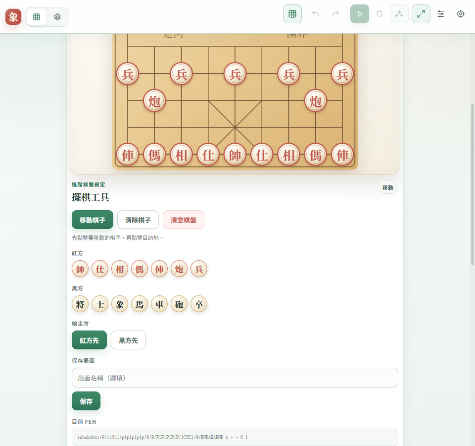
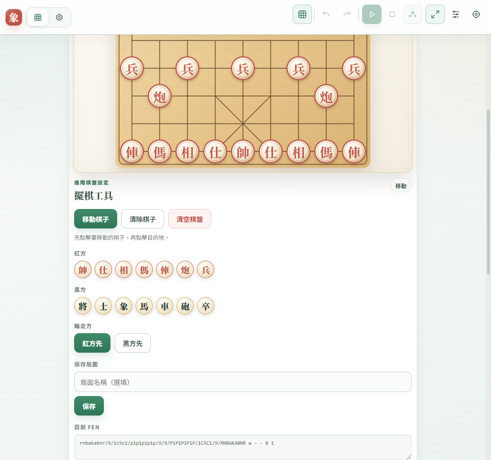
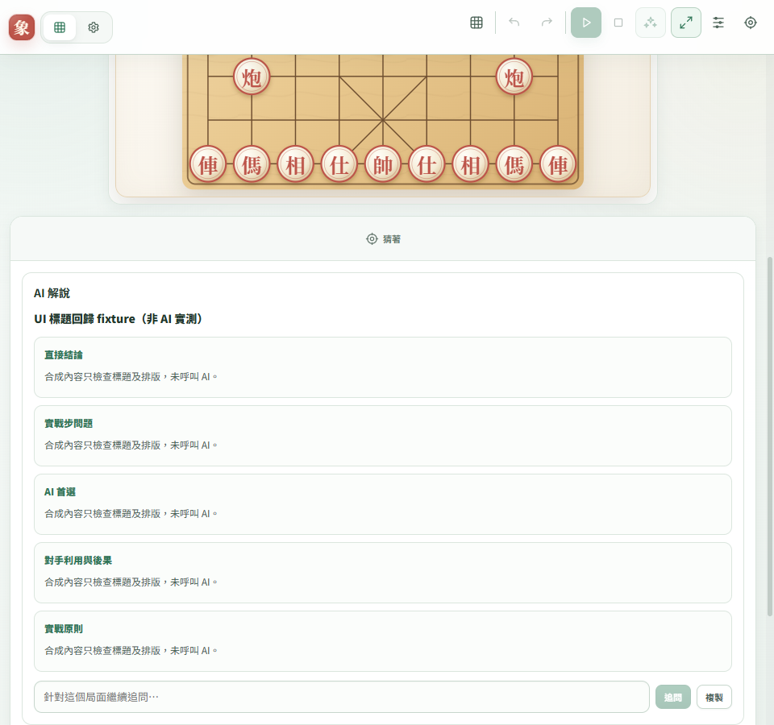
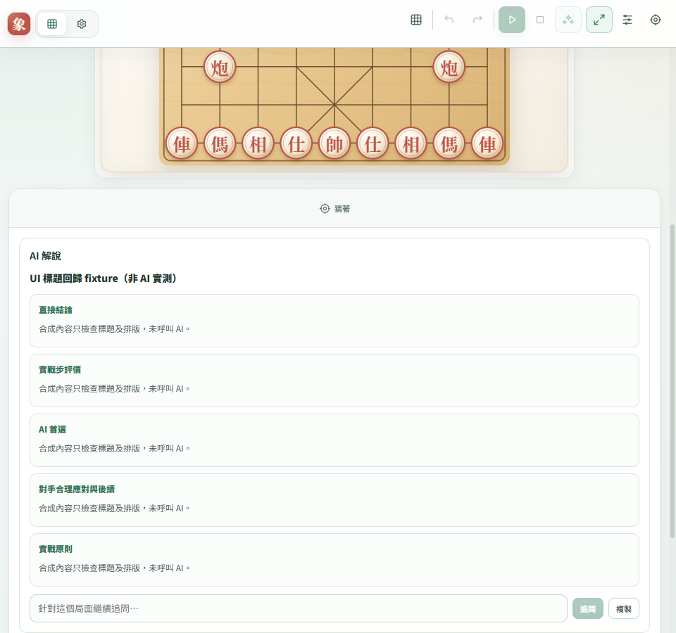

# UI 前後比較：2026-10-04

供 CONTRIBUTING.md 的 PR 截圖審查。這四張圖是隔離來源 React/CSS fixture，使用公開初局與合成文字；**沒有呼叫 AI，不是完整答案驗收，也不是已安裝或候選 binary 的 UI 證據**。圖片的合成正文不代表棋理解釋。

前版來源 `4ef3e8491f693813f056bbd31b8aeadd8af590b5`，後版來源 `4de38ce5dad84fda04e5111378f7b8a6058ae6e1`。固定 960×900、100% zoom。檔案大小、SHA-256、來源與證據類別見 [manifest.json](manifest.json)。後續 `e91dbd7` 僅修改棋盤語句驗證與測試，沒有更動此介面。

## 目前 FEN

前版為 code 文字；後版為原生唯讀 textarea、固定名稱「目前 FEN」，可選取複製。圖只證明來源介面外觀；真實 Chromium UIA 的唯一 Edit／唯讀／完整 FEN 辨識由隔離 Windows 驗收另行判定。

### 前版

### 後版

## 數值差異狀態的中性標題

以同一組 section id 和合成正文比較 `evidence_backed_difference`。標題從各自來源的 SECTION_HEADINGS、COMPARISON_SECTION_HEADINGS 與 applyComparisonPresentation 計算，沒有手工指定變更後標題。數值分類可提供比較資料，不能預設一定存在失誤或對手懲罰。

### 前版

### 後版

## 實際執行與限制

先以 git archive 匯出上述兩個固定提交的 src、tests/support、tests/e2e/rendererLayout.e2e.cjs 與 package.json 到 `D:/DevTemp/reckoning-ui-before-after-oct04/{before,after}`；各自只連結現有 node_modules。暫存 prepare-screenshots.cjs 用 TypeScript AST 擷取來源的三個呈現定義與 HARNESS_SECTION_IDS，替換 fixture 文字；附加 FEN／標題可見範圍 capture，quick viewport 改為 960×900。沒有改正式工作目錄程式、已安裝 App 或 AppData。

實際命令：`node node_modules/electron/cli.js D:/DevTemp/reckoning-ui-before-after-oct04/{before,after}/tests/e2e/rendererLayout.e2e.cjs --quick --artifact-dir D:/DevTemp/reckoning-ui-before-after-oct04/{before,after}-review-artifacts`。兩次 exit 0；來源布局檢查與截图已人工查看。紀錄 `ui-{before,after}-review-{4ef3e84,4de38ce}-oct04.log/.exit.txt`。

最初截圖 fixture 的區塊標記誤用 `##`，無法呈現五個標題；改為正式 renderer 接受的 `###` 後重新 capture。最初產物沒有收入本 PR，也不作這份 UI 交付證據。此一組視窗不替代既有 36 組來源布局矩陣或實際 Windows binary 驗收。
